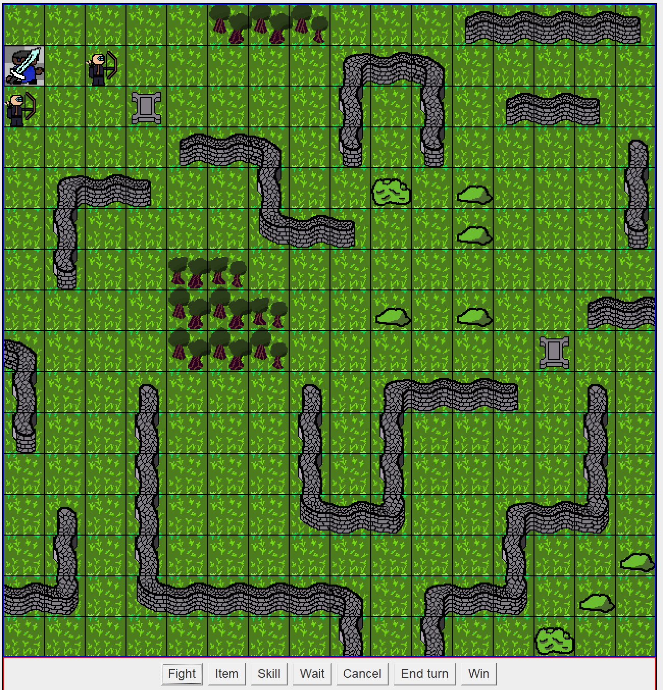
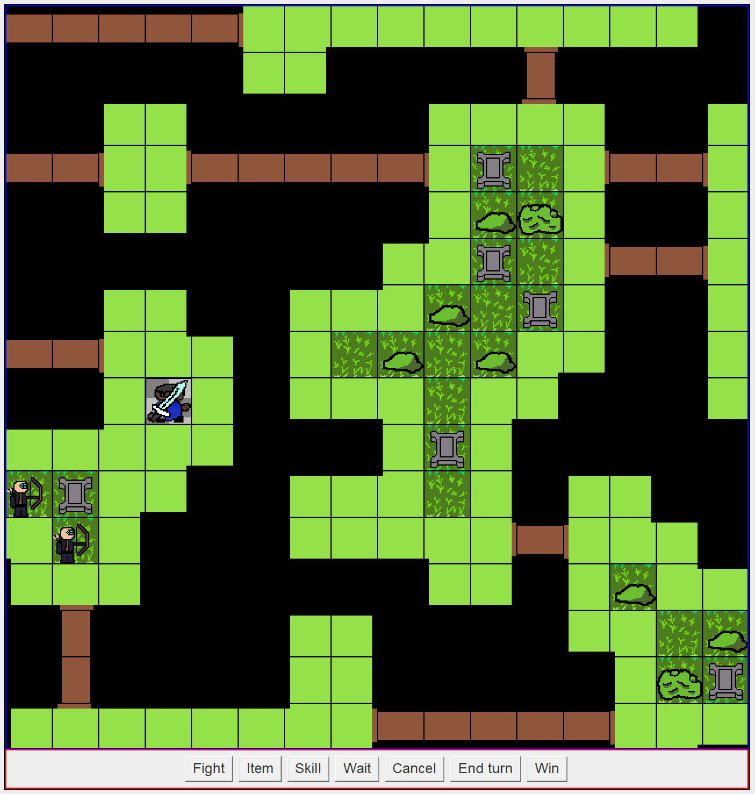

# Wavefunction Tester

This respository is a place I am learning to write my own wavefunction collapse algorithm. This is modelled after the wavefunction collapse found here: https://robertheaton.com/2018/12/17/wavefunction-collapse-algorithm/. This algorithm is used for procedural map generation in a video game project of mine. It uses patterns and tilesets to generate maps that obey certain patterns and rules. Taking inspiration from quantum mechanics, it does this by putting each tile into a superposition of states. The algorithm selects a state with low entropy (small number of states) and picks a random state. From here, it propogates that change into the surrounding tileset, which eliminates any impossible states.

The results are shown below:

<div style="display: flex; gap: 10px; justify-content: center; flex-wrap: wrap;">
    
    
</div>

This supports multiple types of maps and tiles, and it supports more tilesets. This iteration was coded in java, and the new version is in c#. I switched to unity to allow greater support for data 


```python

```
